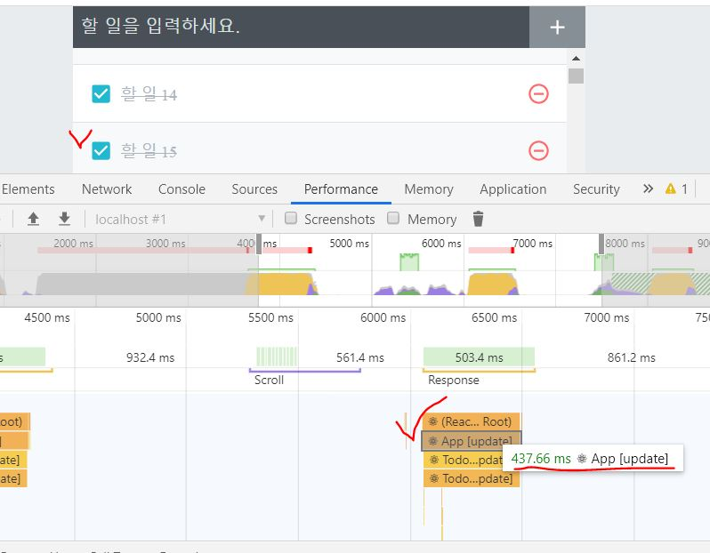

# Component 성능 최적화

10장에서 만든 todo-app ([repo](https://github.com/seong7/react-todo-app)) 을 사용해 컴포넌트 성능 최적화 해보기

#### 많은 데이터 렌더링하기

2,500 개의 todo 데이터를 생성하였더니 lag 이 엄청 심해짐  
삭제, 생성, check 기능 모두 lag 심함

> **컴포넌트는 다음과 같은 상황에서 Re-render 된다.**
>
> 1. 자신이 전달받은 props가 변경될 때
>
> 2. 자신의 state가 바뀔 때
>
> 3. 부모 컴포넌트가 리렌더링될 때
>
> 4. forceUpdate 함수가 실행될 때

#### Chrome 개발자 도구를 통한 성능 모니터링

개발자도구 - Performance 에서 Rocord-Stop 버튼을 사용해 원하는 시점의 성능을 분석할 수 있다.

> **개발 서버를 통해 보이는 리액트 애플리케이션은 실제 프로덕션에서 구동될 때보다 처리 속도가 느리다.**
>
> 실제 프로덕션 모드에서는 에러 시스템 및 Timing이 비활성화되어 처리 속도가 훨씬 더 빠릅니다. 지금은 소규모 프로젝트이기 때문에 프로덕션 모드일 때와 개발 모드일 때의 차이가 그렇게 크지 않지만, 프로젝트의 규모가 커질수록 차이가 커집니다.
>
> **Production 모드에서 구현해보려면**  
> $ yarn build   
> $ yarn global add serve  
> \$ serve -s build

<br/>

## 성능최적화

### 1. React.memo

함수형 component 의 export 문에 React.memo 를 호출하여 component 의 props 값이 바뀌지 않았을 때는 update 되지 않도록 최적화할 수 있다.

**하지만, performance 체크해보면 크게 차이는 없다. (0.2 ~ 0.8 s 정도 단축됨)**

TodoListItem.js [>> 48번 줄]()

> 클래스형 Component 에서는 shouldComponentUpdate() 함수를 사용해 component 의 update (re-render) 여부를 결정할 수 있다.

### 2. 함수가 재선언되는 현상 방지 (최적화 효과 높음)

> Event Handler 인 'onToggle', 'onRemove', 'onInsert'

아래는 onRemove 함수에 useCallback() 을 사용하여, 해당 component 의 state 인 todos 가 변경될 때만 함수를 새로 생성하도록 만든 코드이다.  
(최적화가 덜 진행됨)

```javascript
const onRemove = useCallback(
  (id) => {
    setTodos(todos.filter((todo) => todo.id !== id));
  },
  [todos]
);
```

하지만, todos 가 변경될 때에도 사실 상 함수를 새로 생설할 필요는 없다. (최적화 필요)

<br/>

#### 방법1 : useState 의 setter 함수에 '함수형 매개변수' 사용 [>> App_useState.js]()

setTodos 함수의 매개변수에 기존의 새로운 state 를 바로 넣는 방법 대신  
state 업데이트를 어떻게 할지 정의해 주는 함수를 넣을 수 있다.

아래 코드가 예시이다.
기존과 달리 setTodos() 의 매개변수에 함수를 넣어주었고, 의존성이 사라져 useCallback() 의 두번째 매개변수인 배열은 비워두었다.

> 의존성이 사라진 부분은 잘 이해가 되질 않는다.

```javascript
const onRemove = useCallback((id) => {
  setTodos((todos) => todos.filter((todo) => todo.id !== id));
}, []);
```

**소요된 시간이 1s 이하로 상당히 많이 줄어든 것 확인 가능 !  
(아래 사진 참조)**



<br/>

#### 방법2 : useReducer 사용 [>> App_useReducer.js]()

가장 가독성이 높아 보인다.

**성능 상으로는 두 가지 방법이 비슷함**

### react-virtualized 를 사용한 redering 최적화
