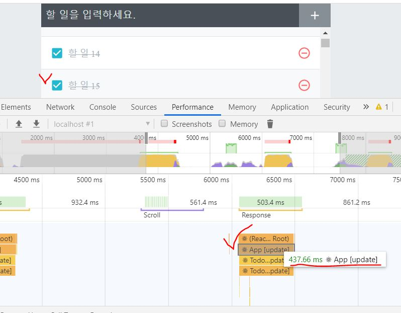

## 성능최적화

### 1. React.memo

본래 부모 컴포넌트가 re-render 되면 자식 컴포넌트도 자동으로 re-render 된다. 하지만, 함수형 component 의 export 문에 React.memo 를 호출하면 부모 component 가 re-render 되더라도 해당 component 의 props 값이 바뀌지 않았을 때는 re-render 되지 않도록 최적화할 수 있다.

**하지만, performance 체크해보면 크게 차이는 없다. (0.2 ~ 0.8 s 정도 단축됨)**

TodoListItem.js [>>](https://github.com/seong7/react-todo-app/blob/master/src/components/TodoListItem.js#L48)  
TodoList.js [>>](https://github.com/seong7/react-todo-app/blob/master/src/components/TodoList.js#L22)

list 관련 컴포넌트는 list 자체와 그 요소들을 모두 최적화해준다.  
하지만, 데이터가 100개가 넘지 않거나, 업데이트가 자주 없는 것이라면 크게 상관은 없다.

> 클래스형 Component 에서는 shouldComponentUpdate() 함수를 사용해 component 의 update (re-render) 여부를 결정할 수 있다.

### 2. 함수가 재선언되는 현상 방지 (최적화 효과 높음)

> Event Handler 인 'onToggle', 'onRemove', 'onInsert'

아래는 onRemove 함수에 useCallback() 을 사용하여, 해당 component 의 state 인 todos 가 변경될 때만 함수를 새로 생성하도록 만든 코드이다.  
(최적화가 덜 진행됨)

```javascript
const onRemove = useCallback(
  (id) => {
    setTodos(todos.filter((todo) => todo.id !== id));
  },
  [todos]
);
```

하지만, todos 가 변경될 때에도 사실 상 함수를 새로 생설할 필요는 없다. (최적화 필요)

<br/>

#### 방법1 : useState 의 setter 함수에 '함수형 매개변수' 사용 [>> App_useState.js](https://github.com/seong7/react-todo-app/blob/master/src/App_useState.js)

setTodos 함수의 매개변수에 기존의 새로운 state 를 바로 넣는 방법 대신  
state 업데이트를 어떻게 할지 정의해 주는 함수를 넣을 수 있다.

```javascript
const [number, setNumber] = useState(0);
// prevNumbers는 현재 number 값을 가리킵니다.
const onIncrease = useCallback(
  () => setNumber((prevNumber) => prevNumber + 1),
  []
);
```

아래 코드가 예시이다.
기존과 달리 setTodos() 의 매개변수에 함수를 넣어주었고, 의존성이 사라져 useCallback() 의 두번째 매개변수인 배열은 비워두었다.

> 의존성이 사라진 부분은 잘 이해가 되질 않는다.  
> (아마도 위의 코드처럼, prev 값을 받아 동작하기 때문으로 보임)

```javascript
const onRemove = useCallback((id) => {
  setTodos((todos) => todos.filter((todo) => todo.id !== id));
}, []);
```

**소요된 시간이 1s 이하로 상당히 많이 줄어든 것 확인 가능 !  
(아래 사진 참조)**



<br/>

#### 방법2 : useReducer 사용 [>> App_useReducer.js](https://github.com/seong7/react-todo-app/blob/master/src/App_useReducer.js)

가장 가독성이 높아 보이는 방법이다.

**성능 상으로는 두 가지 방법이 비슷함**
