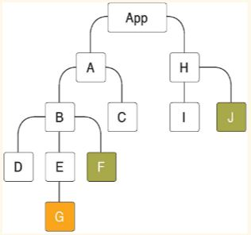

# 15 장 | Context API [>>](./15/context-tutorial)

사용자 로그인 정보, 애플리케이션 환경 설정, 테마 등 전역적으로 필요한 정보를 저장하기 위해 전역 상태를 관리한다.

_기존 방식의 전역 상태는 App.js 의 state 로 각 컴포넌트에 props 으로 전달하여 조작 및 사용하였다._

하지만, 컴포넌트 구조가 깊어지면 아래 사진과 같이 너무 많은 컴포넌트를 거쳐야하는 문제가 발생한다.  
이런 경우 **유지 보수성이 낮아질 수 있다.**



하지만, **Context API / Redux / MobX** 를 사용하면 모든 컴포넌트에서 별도의 전역 state 에 바로 접근할 수 있다.

> **Context API** 는 React v16.3 이후부터 많이 개선되었고,
> 개선된 이후부터는 Redux, MobX 등 별도의 라이브러리 없이도 전역 state 를 쉽게 관리할 수 있게 되었다.

<br/>

## Context API 사용 [[color.js (context) >>](./contexts/color.js)]

> 가장 중요한 흐름 :
>
> **Context 선언  
> => Context.Provider 로 부모 컴포넌트를 감싸준다.  
> => Context.Consumer 로 자식(최종) 컴포넌트를 감싸준다**
>
> **_감싸주기만 해도 context 의 state 를 전역적으로 공유하게 된다._**

#### src 디렉터리에 contexts / components 디렉터리를 각각 생성

contexts 폴더에는 관리할 파일을 생성해 createContext 함수로 Context 를 생성한다. [[color.js](./src/contexts/color.js)]

#### Component 에서 Context 사용하기 (<context.Consumer>)

**[ColorBox.js >>](./src/components/ColorBox.js)**

<context.Consumer> 로 감싼 컴포넌트의 자식 부분에서 Context 객체를 받아 함수 실행한다.

> 함수를 child 로 넣어줌 :  
> **Function as a child 패턴** 또는 **Render Props 패턴** 이라고 부름
>
> 자식 컴포넌트는 해당 함수를 props children 값으로 받아 함수를 실행하여 render 한다.
>
> 아래는 예시

```javascript
//--- RenderProps Component  (children 함수를 받아 실행한다.)
import React from "react";
const RenderPropsSample = ({ children }) => {
  return <div>결과: {children(5)}</div>;
};
export default RenderPropsSample;

//--- 부모 Component 에서 사용할 때 (chiledren 에 함수 넣어준다.)
<RenderPropsSample>{(value) => 2 * value}</RenderPropsSample>;
```

#### 부모 component 에서 Context 값 지정해주기 (<context.Provider>)

**[App.js >>](./src/App.js)**

<context.Provider> 로 감싼 부모 컴포넌트에서 context 값을 새로 지정해주어 사용한다.

<context.Consumer> 로 감싸진 자식 컴포넌트는 그 새로운 context 값을 받아 사용한다.

<br/>

## Context 동적 사용

**1. Color Context 선언 [[color_dynamic.js >>](./src/contexts/color_dynamic.js)]**  
 Provider 를 미리 정의해서 export 시킴

**2. Color Context 를 호출하는 App 선언 [[App_dynamic_hook.js >>](./src/App_dynamic_hook.js)]**  
 Color Context 에서 미리 정의한 ColorProvider 를 import 하여 사용한다.

**3. 최하위 컴포넌트 (ColorBox) 를 선언 [[ColorBox_dynamic.js >>](./src/components/ColorBox_dynamic.js)]**  
 ColorConsumer 를 import 하여 사용

**_중요 !!_**  
**4. 또 다른 컴포넌트 (SelectColors_dynamic.js) 를 이용해 Context 의 setState 이벤트들 사용 [[SelectColors_dynamic.js >>](./src/components/SelectColors_dynamic.js)]**  
 색표를 선택하면 div 의 색이 바뀌도록 설정함

**중요 포인트**

- Consumer 컴포넌트의 children 은 꼭 함수가 와야한다. (컴포넌트는 return 시키기)
- children 의 함수에 매개변수로 state 객체를 받아 children 내에서 setState 함수 사용하는법
- 마우스 우클릭은 onContextMenu() 로 감지한다.

## useContext 사용

**Consumer 대신 useContext Hook 사용해보자**  
RenderProps 패턴 (children 에 함수를 넣는 패턴) 을 사용할 필요 없어져 **훨씬 간편해진다.**

**1. Color Context 선언 [[color_dynamic.js >>](./src/contexts/color_dynamic.js)]**  
 동적사용 부분과 동일한 Context 사용 (동일한 전역 state 공유하게됨)

**2. Color Context 를 호출하는 App 선언 [[App_dynamic_hook.js >>](https://github.com/seong7/React_study/blob/master/15/context-tutorial/src/App_dynamic_hook.js#L24)]**  
 Color Context 에서 미리 정의한 ColorProvider 를 import 하여 사용한다.  
 useContext 사용해도 여전히 Provider 로 감싸줘야함

**3. 최하위 컴포넌트 (ColorBox / selectColors) 를 선언**  
**[[ColorBox_hook.js (state 사용) >>](./src/components/ColorBox_hook.js)]**  
**[[SelectColors_hook.js (setState 사용) >>](./src/components/SelectColors_hook.js)]**  
 hook 사용 부분임 (코드 간단함)

<br/>

## static contextType 사용 (class 컴포너트 용)

단점 : 한 클래스에 하나의 context 밖에 사용하지 못한다. (함수형 컴포넌트와 useContext 사용이 더 권장됨)

**1. Color Context 선언 [[color_dynamic.js >>](./src/contexts/color_dynamic.js)]**  
 useContext 부분과 동일한 Context 사용 (동일한 전역 state 공유하게됨)

**2. Color Context 를 호출하는 App 선언 [[App_dynamic_hook.js >>](https://github.com/seong7/React_study/blob/master/15/context-tutorial/src/App_dynamic_hook.js#L28)]**  
 Color Context 에서 미리 정의한 ColorProvider 를 import 하여 사용한다.  
 contextType 을 사용해도 여전히 Provider 로 감싸줘야함

**3. 최하위 컴포넌트 (selectColors) 를 선언**  
**[[SelectColors_contextType.js (setState 사용) >>](./src/components/SelectColors_contextType.js)]**  
 contextType 사용 부분임 (코드 간단함)
