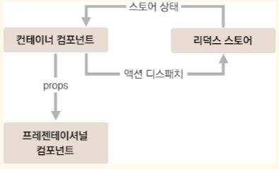

# react-redux

## 환경

```bash
$ npm install redux react-redux
```

## 컴포넌트 구조

redux 를 사용할 때는 **presentational** 컴포넌트와 **container** 컴포넌트를 구분하여 관리하는 패턴을 많이 사용한다.



- **presentational 컴포넌트**  
  state 관리가 이루어지지 않고, 그저 props 를 받아 render 만 해주면 되는 컴포넌트  
  _src/components 에서 관리_

- **container 컴포넌트**  
   redux 와 연동되어 있음, redux 로부터 state 를 받아오거나 redux store 에 action 을 dispatch 하기도 하는 컴포넌트
  _src/containers 에서 관리_

<br/>

## redux 관련 코드 구조

**일반적인 패턴 (redux 공식문서에도 나옴)**

- actions (action type 정의)
- contants (action 생성 함수)
- reducers
  위의 세 폴더를 생성하고 모든 기능의 redux 관련 코드 파일들을 해당되는 폴더에 분류하여 정리

_단점 : 하나의 action 을 만들면 세 종류의 파일을 모두 각각 수정해줘야하는 불편함 발생_

**Ducks 패턴 (위의 방법 개선)**  
각각의 기능별로 action type, action 생성 함수, reducer 를 한 파일에 몰아서 다 작성하는 방식 (module 화)

_이 프로젝트에서 사용_

<br/>

## 프로젝트 작성 순서 요약

1. **components 생성 [[Todos.js >>](./src/components/Todos.js)]**

2. **modules 폴더에 각 reducer module 파일 생성 [[todos.js >>](./src/modules/todos.js)]**

   - action type 정의
   - action 생성 함수 정의 및 export
   - state 초기화
   - reducer 생성 및 export default  
     (reducer 는 직접 호출하지 않고 dispatch 함수를 통해 실행시킨다)

3. **combineReducers 함수 (redux 제공함수) 로 reducer 들 합쳐줌** (store 에선 하나의 reducer 만 저장 가능하므로) [[index.js >>](./src/modules/index.js)]

   > 파일이름을 index.js 로 해주면 다른 파일에서 imoprt 할때 디렉터리까지의 경로만 쓰면 자동으로 불러와짐  
   > ex) from './modules' 하면 index.js import 됨

4. **store 를 만들고 React 앱에 redux 적용**  
   [src/index.js](./src/index.js) 에서 이루어짐

   1. 관련 함수들 import
   2. store 생성
   3. react-redux 의 Provider 로 App 을 감싸준다.

5. **Redux DevTools 설치**  
   Chrome 확장 프로그램임 [[설치페이지 >>](https://chrome.google.com/webstore/detail/redux-devtools/lmhkpmbekcpmknklioeibfkpmmfibljd)]

   - 사용 예시

     **1. node package 없이 사용할 경우**

     ```javascript
     // store 생성 부분에서 사용한다.

     const store = createStore(
     rootReducer, /* preloadedState, */
         window._ _REDUX_DEVTOOLS_EXTENSION_ _ && window._ _REDUX_DEVTOOLS_EXTENSION_ _()
     );
     ```

     **2. node package 받아 사용할 경우**

     코드가 더 깔끔해지므로 권장

     ```bash
     $ yarn add redux-devtools-extension
     ```

     composeWithDevTools import 후 store 생성문에 사용 [[src/index.js L13 >>](https://github.com/seong7/React_study/blob/master/17/react-redux-tutorial/src/index.js#L13)]

     적용 후 chrom dev tool 에서 redux 메뉴 확인 (state 확인)

6. **store 에서 state 받고 action dispatch**

   - containers 생성하기 [[CounterContainer.js >> ](./src/containers/CounterContainer.js)]

     1. mapStateToProps 함수 정의 (redux 의 state 를 변수에 담아 해당 컴포넌트의 props 로 전달))

     2. mapDispatchToProps 함수 정의 (redux 의 action 정의 함수를 변수에 담아 해당 컴포넌트의 props 로 전달)

     3. component render (props 로 위에서 정의한 변수들에 담긴 state 와 dispatch 함수 받아 사용)

     4. 해당 container export 문에 redux\_ connect 함수 사용해 container 와 redux 연결시켜줌

7. **App.js 에서 container return 시키기**
